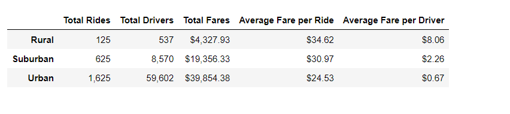
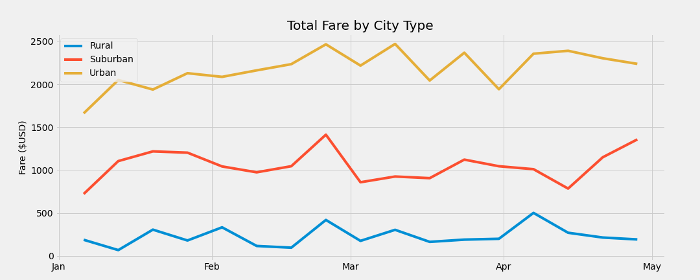

# #  PyBer_Analysis

The purpose of the project is to analyze the Ride Sharing data and create summary DataFrame of the ride-sharing data by city type.
Using Pandas and Matplotlib a multiple-line graph is created that shows the total weekly fares for each city type

# Analysis

- It is evident that Urban areas has the highest number of rides with Total rides summing to 1625
- The average fare per ride is lowest in urban cities in relative to rural areas ($24.53 vs $34.62 and $16.57 vs $55.49)
- Total fares in cities is recorded highest as 39,854.38

On plotting the above data the visualization look like below

# # Summary

- Based on the graph and data Analysis performed it can be suggested that Urban cities fetch more revenue whereas the drivers get more profit in Rural cities.

- The driver count in the urban cities can be reduced as the number of rides are less than the number of drivers count, This can increase average fare price fetching profit to the company.

